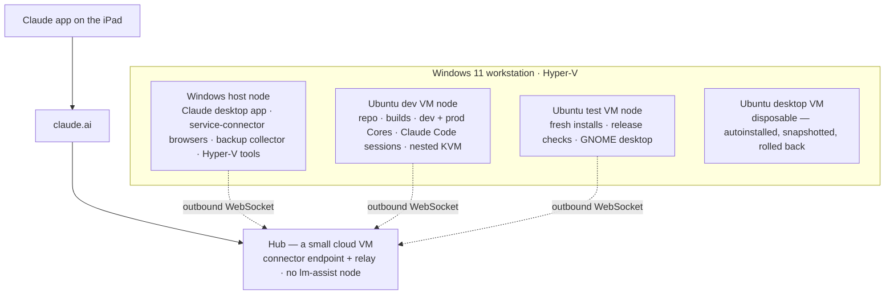

# The server build behind it: one Windows 11 box, Hyper-V, and the Ubuntu VMs that do all the work

*A story from the lm-assist developer · September 2026*

> **The iPad is the console. This is the machine room.**

**TL;DR** — Everything in [the first story](./2026-09-developing-lm-assist-from-an-ipad.md) runs on
one physical machine: a Windows 11 desktop with an 8-core Ryzen and about 2.8 TB across four
volumes, running Hyper-V. Three Ubuntu VMs live on it — a dev VM where the repository, the builds,
the Claude Code sessions, and both lm-assist modes run; a test VM for fresh installs and release
checks; and a disposable desktop VM that was built by unattended autoinstall in about 25 minutes.
lm-assist is installed on the Windows host **and** inside each VM, and every one of them is a node
that dials out to the hub on a small cloud VM. From the Claude app it is one fleet. Nothing on it is
reachable from the internet inbound.

## The shape

## What runs where

| Machine | What it is for | lm-assist there |
|---|---|---|
| **Windows 11 host** (build 26200, 8-core Ryzen, ~2.8 TB over four volumes) | the physical box and the Hyper-V host; the work that needs a real GUI — the Claude desktop app with the connector, the signed-in browsers behind the WhatsApp and LinkedIn connectors; the backup collector, because the big disks are here | the prod node, started as an interactive scheduled task; a second scheduled task runs the elevated worker; cluster `stage` |
| **Ubuntu dev VM** (22.04, 8 vCPU, 19 GB) | the development machine: the repository and its worktrees; the dev Core and Web from the repo on their own ports beside the npm-installed prod node; Claude Code sessions in tmux; a headed Chrome for claude.ai captures and the Gmail connector's browser; nested KVM so the Linux VM backend can be tested without another machine | the prod node (npm) and the dev node (repo) side by side; cluster `prod` |
| **Ubuntu test VM** (22.04, 8 vCPU, 4 GB) | throwaway ground: fresh installs from the packed tarball, release verification, a full GNOME desktop for the one-time interactive logins, a systemd-managed Core | a prod node |
| **Ubuntu desktop VM** (24.04, 4 vCPU, 4 GB) | built from a chat by unattended autoinstall; kept as a saved state; snapshot, try something, roll back | created and managed through lm-assist's VM tools |
| **Hub** (a small cloud VM) | the public connector endpoint and the relay | none — a hub-only host by rule |

## Why this shape

- **One physical machine, several nodes.** The VMs are where risky work happens — builds, test
  runs, upgrades, throwaway guests. The host stays clean and keeps the things that need a real
  desktop.
- **Windows for the GUI-bound work.** The Claude desktop app, the service-connector browsers, and
  Hyper-V all live on the host. The backup collector lives here too, next to the largest disks:
  every VM's Claude state and the claude.ai conversations land in one searchable store.
- **Dev and prod side by side in the dev VM.** The repo's dev Core runs on its own ports next to
  the npm-installed prod node. The connector reaches the prod node, so a broken dev build never
  takes away the tools the iPad depends on — including the tools being used to fix the build.
- **Nested KVM in the dev VM.** The Linux VM backend is tested inside a VM that is itself a Hyper-V
  guest, with tiny guests so they cannot pressure the parent.
- **Clusters keep the tiers apart.** The Windows host sits in a `stage` cluster and the dev VM in
  `prod`, so leader election, mission control, and registry sync stay inside each group while a
  release is being staged.
- **Nothing inbound.** Every node holds one outbound WebSocket to the hub; the hub relays. No VPN,
  no port forwarding, and the iPad needs nothing installed beyond the Claude app.

## Deploying lm-assist on each of them

- **Linux VMs:** the one-line installer or `npm install -g lm-assist` for a prod node; the dev node
  is the repository itself (`npm install --ignore-scripts`, then `./core.sh start`). Details:
  [`install-and-modes.md`](../install-and-modes.md).
- **Windows host:** the PowerShell installer (`install.ps1`), then two scheduled tasks. The Core
  runs in the *interactive* session — a Core started over SSH lands in session 0, looks perfectly
  healthy, and can never type into a Claude Code session. The elevated worker runs at highest
  privilege on loopback, so the non-elevated Core can hand it the things that would otherwise
  raise a UAC prompt: Hyper-V cmdlets, service restarts, git through the package-manager shims.
- **Enrollment:** each node joins with a one-time keypack, then gets its cluster. From that moment
  the connector on the Claude app sees it.
- **Upgrades from the chat:** `node_upgrade` with a prebuilt tarball — never a git ref, whose
  source build dies on a native postinstall. On Windows, npm hits EBUSY on the in-use install
  directory and the engine falls back to a tarball overlay; verify the result by content (the
  reported version, the web build id, the bundled runtime), not by the log's "completed
  successfully". Reference: [`build-pack-install-upgrade.md`](../build-pack-install-upgrade.md).

## The work flowing through it

Condensed from real sessions; the data is illustrative, the tools are the real ones.

> **You:** how are the machines doing?
>
> **Claude:** *(lm-assist → node_status)* All three nodes healthy and hub-connected. One warning on
> the Windows host: four volumes, the busiest at 90% — that's the backup store's volume. The dev VM
> has 8 GB available and both Cores up; the test VM is idle.

> **You:** snapshot the desktop VM, then start it — I want to try the new installer on a clean
> desktop
>
> **Claude:** *(lm-assist → vm_snapshot, vm_power)* Snapshot taken on the Windows host, VM
> started. Say "roll back" and it returns to the snapshot.

> **You:** put 0.2.4 on the test VM from the packed tarball and confirm it's really running it
>
> **Claude:** *(lm-assist → node_upgrade, node_builds)* Upgraded and restarted; the node reports
> 0.2.4 and its build record matches the tarball. Health is green and the web is answering.

> **You:** the Windows Core isn't typing into sessions again
>
> **Claude:** *(lm-assist → elevated_exec)* The Core process is in session 0 — it was started over
> SSH. Restarted it through the interactive scheduled task via the elevated worker; it's in session
> 1 now and the session reports driveable.

> **You:** back up everything tonight and tell me in the morning what changed
>
> **Claude:** *(lm-assist → backup_run, mission_schedule)* Dry run first: 214 changed session files
> and 41 conversations across the three nodes. Scheduled the real pass for 02:00 on the collector;
> I'll report the diff when you ask.

Tools involved: node_status, vm_status, vm_create, vm_snapshot, vm_power, node_upgrade, node_builds, elevated_exec, backup_run, mission_schedule

## Lessons from running Windows as a node

- **The interactive session is not optional.** Core in session 0 is the classic silent failure:
  green health, listed sessions, and `driveable: false` on every one of them. Verify by the
  process's session id, never by health.
- **UAC needs a resident helper.** A second scheduled task at highest privilege, reachable only on
  loopback with the node's token, is what makes Hyper-V, restarts, and deploys hands-free.
- **Upgrades lie unless you check content.** The tarball overlay skipped every same-size change
  because npm normalizes file times; the node ran new code while reporting the old version, with a
  dead web. Fixed in the 0.2.4 engine, and the release gate now diffs same-size files between
  tarballs.
- **The VM console forwards the keyboard only.** Clicks never reach a Hyper-V guest through the
  console, so an installer is driven by an autoinstall seed, not by desktop automation. Twenty-five
  deterministic minutes beat forty minutes of clicking.
- **A CLI is not a daemon.** Docker's CLI on the host proves nothing; the container tools check for
  a server block before they claim availability.
- **Logging off stops the Core** on Windows — the price of living in the interactive session. Use
  autologon if the box must come back without you.

## What it costs

One desktop-class machine, no cloud GPU, and the smallest cloud VM for the hub. Everything that
does real work — builds, tests, sessions, browsers, backups, VMs — runs at home, and the iPad is
only ever a window onto it.

## Related

[`vm-management.md`](../vm-management.md) · [`install-and-modes.md`](../install-and-modes.md) ·
[`build-pack-install-upgrade.md`](../build-pack-install-upgrade.md) ·
[`node-placement.md`](../node-placement.md) (clusters) · [`container-management.md`](../container-management.md) ·
[`examples/transfer-and-backup`](../../examples/transfer-and-backup/) ·
[the first story](./2026-09-developing-lm-assist-from-an-ipad.md)
