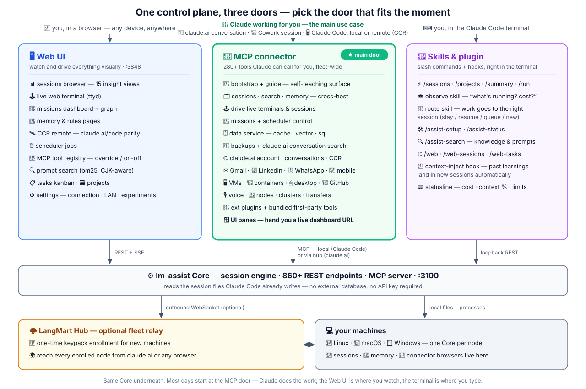

# lm-assist Examples

One folder per use case — a walkthrough, the exact commands/tools involved, and screenshots from a real running fleet.

**How to read it:** the **MCP connector** (center) is the main door — it's how Claude itself uses your
fleet, whether you're in a claude.ai conversation, a Cowork session, or a Claude Code session (local
or remote/CCR). The **Web UI** is where you watch and drive things visually; the **skills & plugin**
door lives inside the Claude Code terminal; the Core's own **REST API** is the fourth door, for
systems. All four land on the same Core — and what that Core manages is every kind of Claude work:
local Claude Code sessions, remote/cloud code sessions (CCR), and claude.ai conversations themselves. Inside the MCP door the map separates **core** (everything
Claude: sessions, conversations, memory, missions, panes, usage) from **extended** (beyond Claude,
via the ext MCP API: browser-driven connectors like Gmail/LinkedIn/WhatsApp, VMs, containers,
desktop, data, transfers, plugins).

> **About the screenshots:** they are captured from real accounts on a live deployment, so all
> personal content (email text, chat names, message previews, account identifiers, keys, internal
> addresses) is deliberately blurred at capture time. The UI chrome is what matters.

| Example | What it shows |
|---------|---------------|
| [mcp-connector-install](./mcp-connector-install/) | Put lm-assist's 280+ MCP tools inside Claude Code and claude.ai |
| [claudeai-browser-auth](./claudeai-browser-auth/) | Give a node a claude.ai browser session — and what lm-assist then automates for the connector |
| [claudeai-conversation-search](./claudeai-conversation-search/) | Full-text search across ALL your claude.ai conversations |
| [ui-panes](./ui-panes/) | Claude hands you a live dashboard URL mid-conversation — pluggable UI pages on the gateway |
| [cross-node-memory](./cross-node-memory/) | Claude Code memory made one surface across every project and machine — search, compare, import |
| [backlog-tracking](./backlog-tracking/) | A fleet-synced issue/idea graph with typed edges that sessions and missions both work from |
| [mission-autopilot](./mission-autopilot/) | Self-driving Claude Code sessions — mission controller, workflows, auto-resume, model-limit fallback |
| [transfer-and-backup](./transfer-and-backup/) | Resumable cross-node file transfer + searchable backup of every host's Claude state |
| [gmail-connector](./gmail-connector/) | Read and act on Gmail from any Claude session (CDP, your own logged-in browser) |
| [whatsapp-connector](./whatsapp-connector/) | WhatsApp via the Meta Cloud API connector (webhook-ingested store, template/24h rules); personal WhatsApp Web provider in an open PR |
| [linkedin-connector](./linkedin-connector/) | LinkedIn reads/writes with no personal API — a real driven browser |

All connector tools are node-scoped: they are advertised fleet-wide, but each call routes to one
node, and only a node whose own browser is signed in can serve it. Check the matching `*_status`
tool per node first.
