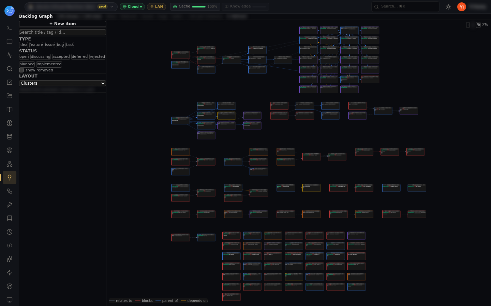

# Backlog — issue & idea tracking Claude can use

A fleet-synced backlog graph: ideas, features, issues, bugs, and tasks as typed items with
statuses (`open → discussing → accepted → planned → implemented`, or `deferred`/`rejected`) and
**typed edges** — `relates-to`, `blocks`, `parent-of`, `depends-on`. It lives in the fleet data
service, so every node and every Claude session sees the same graph.

## From any Claude session

```
backlog_create(type: "issue", title: "…", body: "…")   → bl_… id
backlog_list(status: "open")                            → the working set
backlog_get(id) / backlog_update(id, status: "accepted")
backlog_link(a, b, "blocks")                            → typed edge
backlog_graph(id)                                       → the item's whole connected group
backlog_review / backlog_discuss                        → structured triage passes
```

Because it's a first-class MCP surface, sessions file what they find as they work — a bug
discovered mid-task becomes a linked `bl_…` item instead of a lost TODO comment — and mission
control can pick items up from the same graph (a mission carries the backlog ids it serves).

## The graph view



Filter by type and status, search by title/tag/id, cluster layout, and a legend for the edge
types. The same page ships as a standalone UI pane (see [ui-panes](../ui-panes/)).

Notes:
- Statuses rot if nobody tends them — `backlog_review` exists precisely to sweep stale items
  against reality before you trust the board.
- Items are fleet data: create on any node, read from any session, link across projects.
