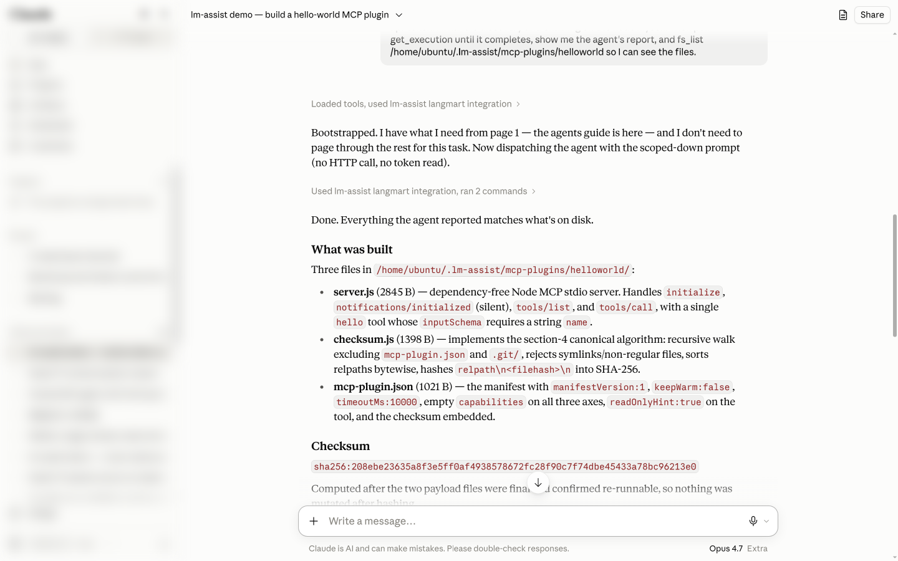
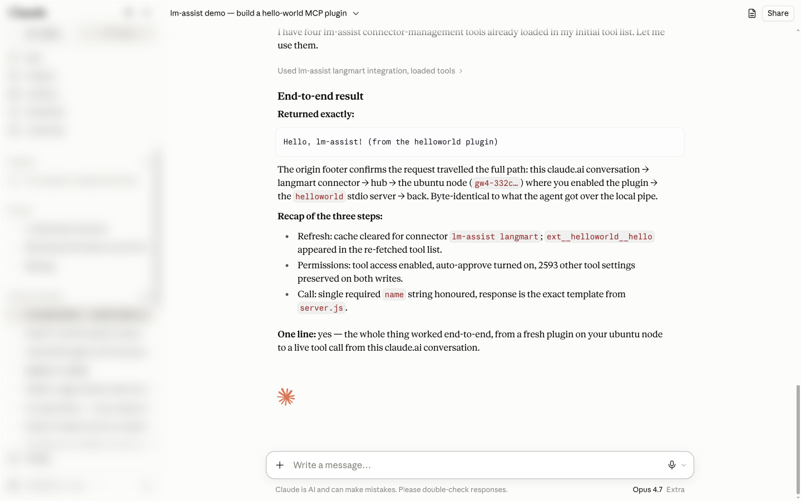

# Advanced: build your own MCP plugin — from a claude.ai conversation, end to end

Goal: extend lm-assist with a brand-new tool **without touching a terminal** — from a claude.ai
conversation, using only lm-assist's own MCP tools — then reconnect the connector, set the new
tool's permissions, and prove it works end to end. This is the **extended MCP interface**: any
standard MCP stdio server dropped into a node's plugin directory becomes `ext__<plugin>__<tool>`
on the connector. Everything below is a real run; the exchanges are lightly condensed.

## The contract in one paragraph

A plugin is a directory `<data-dir>/mcp-plugins/<name>/` (`~/.lm-assist/mcp-plugins/` by default)
holding an `mcp-plugin.json` manifest and a standard **MCP stdio server** (newline-delimited
JSON-RPC: `initialize`, `notifications/initialized`, `tools/list`, `tools/call`). The manifest
declares the tools, an `entry` command, mandatory `capabilities` (`network`/`fs`/`env` — empty
lists are fine), and a **payload checksum** over every file except the manifest. Discovery ≠
execution: a dropped-in plugin is listed as *disabled* and never runs until the owner enables it.
Full spec: [`docs/mcp-plugin-contract.md`](../../docs/mcp-plugin-contract.md).

## 1. Build it — Claude drives an agent on the node

> **You:** I want to build and test a brand-new MCP plugin using only lm-assist, without touching
> a terminal myself. Run an agent on my ubuntu node that creates a `helloworld` plugin — a
> dependency-free stdio server with one tool `hello`, the manifest with the section-4 checksum —
> and have it verify the server over a pipe. Don't enable it; I'll do that on the node.
>
> **Claude:** *(lm-assist → bootstrap, list_nodes, agent_execute)* Bootstrapped and found your
> ubuntu node. Agent dispatched with the scoped-down task — no token read, no HTTP call. Polling
> for completion…
>
> **Claude:** *(lm-assist → get_execution, fs_list)* Completed clean. Three files in
> `~/.lm-assist/mcp-plugins/helloworld/`: `server.js` (the stdio server — `initialize`,
> `notifications/initialized`, `tools/list`, `tools/call`, one `hello` tool with a required
> string `name`), `mcp-plugin.json` (checksum `sha256:208e…13e0`), and `checksum.js` (the
> section-4 algorithm, part of the payload). The pipe test returned exactly
> `Hello, lm-assist! (from the helloworld plugin)`.

Worth noticing: before dispatching, Claude *pushed back* on one detail of the original ask —
having the agent read the node's API token for a discovery check — and proposed keeping every
token-touching step on the owner's side. That's the split the contract wants.



Tools involved: bootstrap, list_nodes, agent_execute, get_execution, fs_list

## 2. Enable it — the one human step, on the node

Enabling is a **loopback-only owner action** by design: it cannot be done over the LAN, through
the hub relay, or by an agent. On the node, review the files, then enable while pinning the exact
checksum you reviewed (a mismatch refuses — the payload can't be swapped under you):

```bash
curl -s -H "x-api-key: $(cat ~/.lm-assist/api-token)" http://127.0.0.1:3100/mcp-plugins   # helloworld: disabled, checksum sha256:208e…
curl -s -X POST -H "x-api-key: $(cat ~/.lm-assist/api-token)" -H 'Content-Type: application/json' \
  -d '{"checksum":"sha256:208ebe23635a8f3e5ff0af4938578672fc28f90c7f74dbe45433a78bc96213e0"}' \
  http://127.0.0.1:3100/mcp-plugins/helloworld/enable
# → phase: enabled · approvedChecksum pinned · connectorSync: started
```

The same switch lives on the **MCP Tools → Plugins** panel of the dashboard. Enabling also kicks
off the connector sync (cache clear → refetch → tool access → auto-approve) on its own:


## 3. Reconnect, set permissions, test — back in the conversation

> **You:** I've reviewed the files, pinned that checksum, and enabled the plugin on the node. Now
> finish the loop: refresh the connector so the new tool is offered, make sure it has tool access
> and is auto-approved, then call it with name "lm-assist" and show me exactly what it returned.
>
> **Claude:** *(lm-assist → refresh_connector_tools)* Cleared claude.ai's tool cache for the
> connector *lm-assist langmart* — the list re-fetches on the next bootstrap.
>
> **Claude:** *(lm-assist → list_claudeai_connectors)* `ext__helloworld__hello` is in the
> connector's tool list now — the extended MCP surfaced it after the refresh.
>
> **Claude:** *(lm-assist → set_connector_tool_access, set_connector_auto_approve)* Tool access
> enabled and auto-approval turned on for exactly that tool; the other 2,593 tool settings on the
> account are preserved on both writes.
>
> **Claude:** *(lm-assist → ext__helloworld__hello)* Returned exactly:
> `Hello, lm-assist! (from the helloworld plugin)` — and the origin footer shows the whole path:
> this conversation → langmart connector → hub → the ubuntu node where you enabled the plugin →
> the `helloworld` stdio server → back. Byte-identical to what the agent got over the local pipe.
> **One line: yes — the whole thing worked end to end.**



Tools involved: refresh_connector_tools, list_claudeai_connectors, set_connector_tool_access, set_connector_auto_approve, ext__helloworld__hello

On the node, the plugin's audit log recorded the call independently: `tool: hello · outcome: ok ·
37 ms · 46 bytes` — every extended-tool call is journaled per plugin (`GET /mcp-plugins/<name>/audit`).

## What to take from it

- **Two human gates, both deliberate**: running an agent on a node (`agent_execute` is an
  admin tool) and enabling a plugin (loopback-only, checksum-pinned). Everything else — building,
  verifying, reconnecting, permissions, testing — Claude did through lm-assist.
- **Reconnect is a tool call**: `refresh_connector_tools` clears claude.ai's cached list; the
  enable route already runs the full sync chain automatically when the node holds a claude.ai
  session, so on most days you won't even need step 3's first call.
- **Permissions are per tool**: `set_connector_tool_access` decides what the account may use,
  `set_connector_auto_approve` decides what runs without a click — the same switches you'd flip
  under *Connectors → Tool access* in the composer.
- The plugin never had to know lm-assist exists: a plain MCP stdio server, namespaced and
  governed by the loader.
