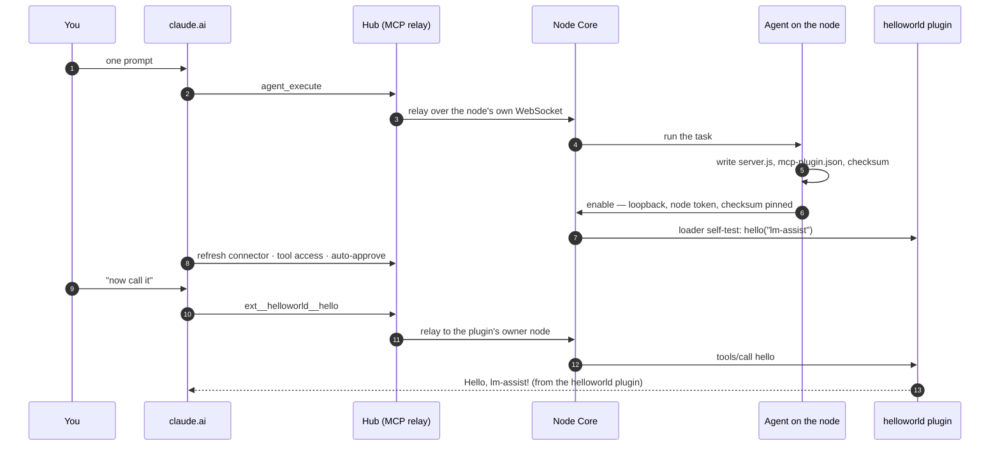
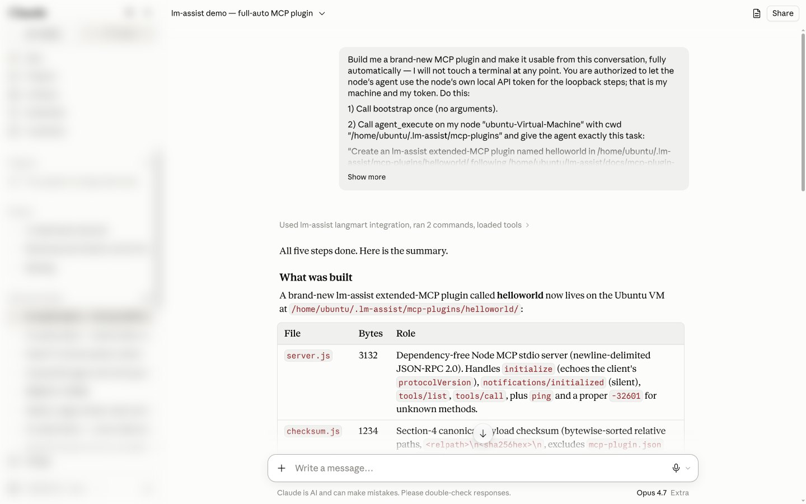
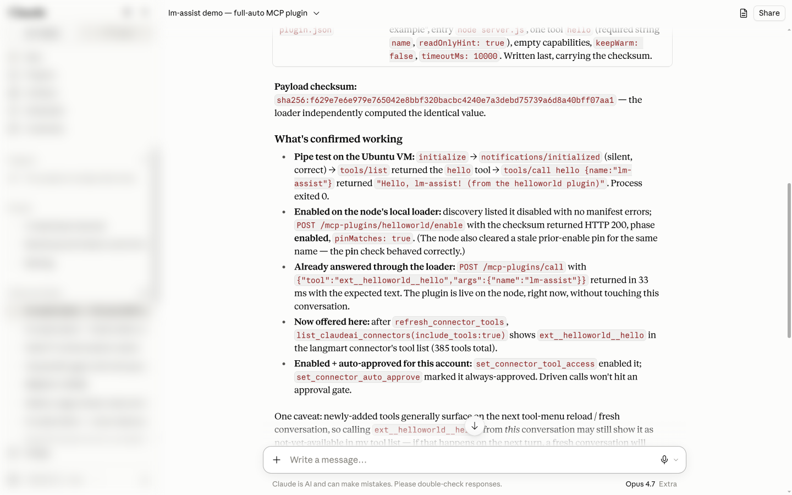
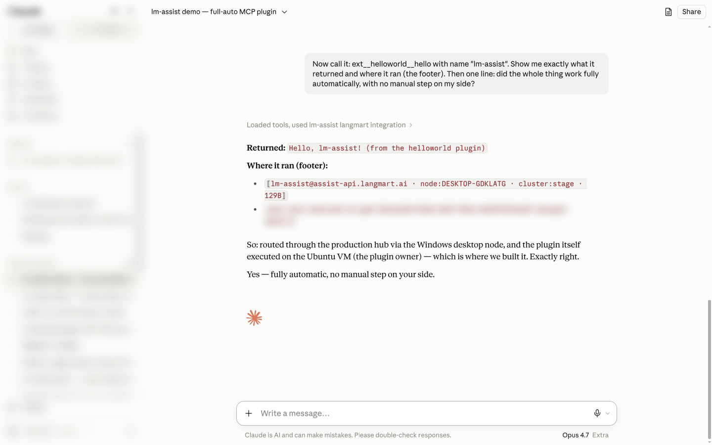
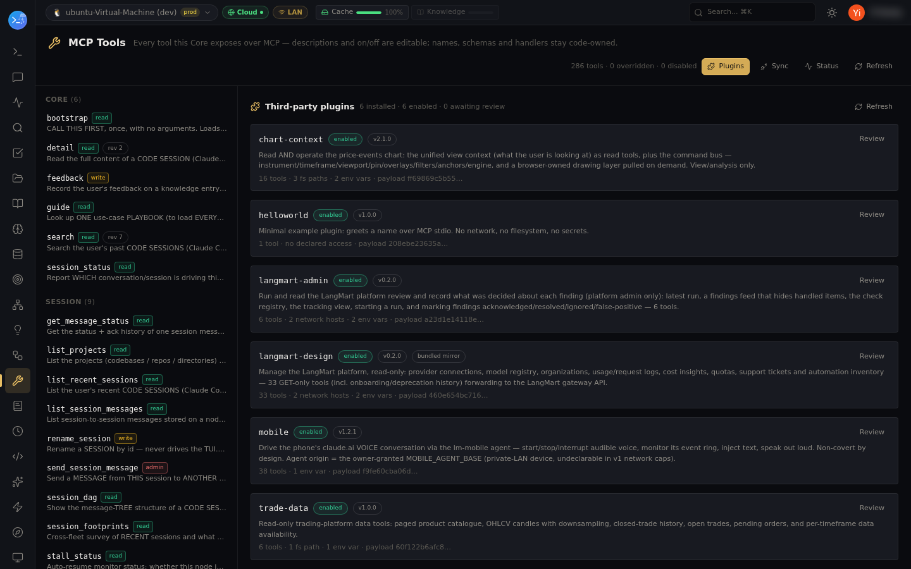

# Advanced: build your own MCP plugin — one prompt, fully automatic

One prompt in a claude.ai conversation. No terminal, no human gate. An agent on the node writes a
brand-new MCP plugin, **enables it itself** over loopback with the node's own token, and self-tests
it through lm-assist's loader; claude.ai then reconnects the connector, sets the new tool's
permissions, and calls it. This is the **extended MCP interface**: any standard MCP stdio server
dropped into a node's plugin directory becomes `ext__<plugin>__<tool>` on the connector
([contract](../../docs/mcp-plugin-contract.md)). Everything below is one real run, lightly condensed.

## The prompt

> **You:** Build me a brand-new MCP plugin and make it usable from this conversation, fully
> automatically — I will not touch a terminal at any point. You are authorized to let the node's
> agent use the node's own local API token for the loopback steps; that is my machine and my token.
>
> 1) Call `bootstrap` once. 2) `agent_execute` on my node with this task: *create a `helloworld`
> plugin in `~/.lm-assist/mcp-plugins/helloworld/` following the plugin contract — a
> dependency-free stdio server with one tool `hello`, the manifest with the section-4 checksum;
> verify the server over a pipe; then **enable it yourself on loopback** — `POST
> /mcp-plugins/helloworld/enable` with the checksum and the node's `x-api-key`, never printing the
> token — and call it through the loader (`POST /mcp-plugins/call`).* 3) Poll until it completes,
> show me the report, `fs_list` the directory. 4) Reconnect this connector: `refresh_connector_tools`,
> then `list_claudeai_connectors` to confirm `ext__helloworld__hello` is offered. 5) Permissions:
> `set_connector_tool_access` and `set_connector_auto_approve` for it. Then summarize. I'll ask you
> to call it in my next message.

## How the call flows

## The result

> **Claude:** *(lm-assist → bootstrap, list_nodes, agent_execute, get_execution, fs_list,
> refresh_connector_tools, list_claudeai_connectors, set_connector_tool_access,
> set_connector_auto_approve)* All five steps done. **What was built:** `server.js` (the stdio
> server — `initialize`, `notifications/initialized`, `tools/list`, `tools/call`, one `hello` tool
> with a required string `name`), `checksum.js` (the section-4 algorithm), and `mcp-plugin.json`,
> written last, carrying checksum `sha256:f629…7aa1` — the loader independently computed the
> identical value. **Confirmed working:** the pipe test returned
> `Hello, lm-assist! (from the helloworld plugin)`; discovery listed it *disabled* with no manifest
> errors; the enable over loopback returned HTTP 200, phase **enabled**, `pinMatches: true`; the
> loader call answered in 33 ms with the expected text. **Now offered here:** after the refresh,
> `ext__helloworld__hello` is in the connector's tool list; tool access enabled and auto-approved,
> so driven calls won't hit an approval gate. Go ahead and ask me to call it.
>
> **You:** Now call it: `ext__helloworld__hello` with name "lm-assist". Show me exactly what it
> returned and where it ran. Then one line: did the whole thing work fully automatically, with no
> manual step on my side?
>
> **Claude:** *(lm-assist → ext__helloworld__hello)* **Returned:**
> `Hello, lm-assist! (from the helloworld plugin)`. **Where it ran:** the footer shows the call
> entering through the hub on the default node and executing on the plugin's owner node — the
> machine where the agent built it. **Yes — fully automatic, no manual step on your side.**

Tools involved: bootstrap, list_nodes, agent_execute, get_execution, fs_list, refresh_connector_tools, list_claudeai_connectors, set_connector_tool_access, set_connector_auto_approve, ext__helloworld__hello

On the node, the plugin's audit journal (`GET /mcp-plugins/helloworld/audit`) recorded the run
independently: the agent's loader self-test (`hello · ok · 30 ms`) and the claude.ai call
(`hello · ok · 36 ms`). From prompt to greeting took about seven minutes, nearly all of it the
agent's build.

## Screenshots

The prompt, and Claude's report after all five steps — one turn, one integration line:

What Claude confirmed: checksum match, enabled over loopback with the pin, loader self-test, tool
offered, access and auto-approval set:

The call — `ext__helloworld__hello` answered through the hub and executed on the plugin's owner:

On the dashboard, **MCP Tools → Plugins** shows the plugin enabled — the same switch, if you ever
want it manual:

## Notes

- **Why it could be automatic:** enabling a plugin is loopback-only by design — it cannot be done
  over the LAN, through the hub relay, or from claude.ai. An agent running *on* the node with the
  node's own token is on loopback, and the prompt authorized exactly that. Governance still holds:
  the checksum is pinned at enable, every call is journaled, and access/auto-approval are per tool.
  For a payload you did not author, keep enabling manual — see the
  [contract](../../docs/mcp-plugin-contract.md).
- **Reconnect and permissions are tool calls:** enabling already kicks off the connector sync
  (cache clear → refetch → tool access → auto-approve) when the node holds a claude.ai session;
  asking for `refresh_connector_tools` and the two `set_connector_*` calls explicitly makes the
  result verifiable in the transcript.
- **Extended tools are node-scoped like everything else:** the call landed on the default node and
  was forwarded to the node that owns the plugin — the footer names both hops.
- The plugin never had to know lm-assist exists: a plain MCP stdio server, namespaced and governed
  by the loader.
