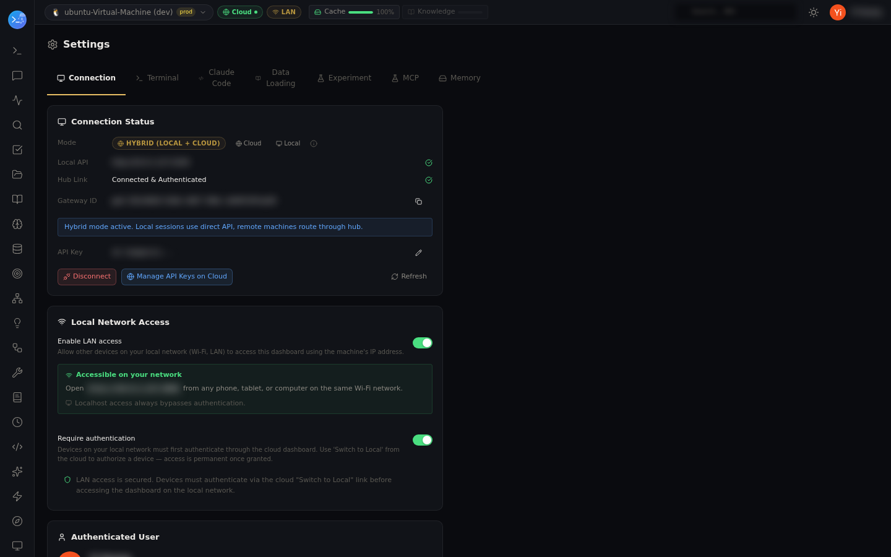

# claude.ai browser authentication — and what it unlocks automatically

Goal: give a node a real claude.ai web session (the browser cookie), so the 28-endpoint claude.ai
proxy works — conversations, rename, token measurement, fork, org settings, voice — and so the
node can maintain your claude.ai connector for you.

## One-time: capture the session from a real browser

From any connected Claude session:

```
claudeai_login(which="cookie")
```

- On a node with a desktop browser, this launches a controlled browser at claude.ai
  (`POST /claude-ai/browser/launch-and-capture`) — sign in normally, and the session cookie is
  captured into the node's credential store.
- On a headless node, the tool prints the exact manual steps instead (copy the `Cookie:` header
  from DevTools into `~/.claude/claudeai-session.json`). The cookie is IP-pinned to the host that
  captured it, so capture it on the node that will use it.
- The tool re-checks `/claude-ai/healthz` at the end so you see the result immediately.

## Kept fresh automatically

The **auth monitor** runs browser-free in the background: it proactively renews the Claude Code
OAuth token before expiry and tracks claude.ai cookie health (including when the session expires)
into a per-node snapshot. `auth_status(allNodes: true)` sweeps the whole fleet in one call.

The Settings → Connection page shows the node's hub link and key state at a glance:



## The automatic part: connector upkeep

Once a node holds a valid claude.ai cookie, lm-assist maintains your claude.ai connector without
manual steps. claude.ai keeps three layers of per-account state that used to require a manual
chain every time the tool surface changed; when a plugin's tools appear or disappear, the node now
runs the whole chain itself:

1. clear the connector's cached tool list
2. force the bootstrap refetch (claude.ai re-pulls `tools/list`)
3. enable account-level tool access for the new tools
4. mark them auto-approved so driven calls don't die on "No approval received"

Every step is an idempotent read-modify-write against claude.ai's own APIs, through the captured
cookie. On a node with no cookie the sync is deferred, not failed — another node (or a manual
`POST /mcp-plugins/sync-connector`) can complete it.
