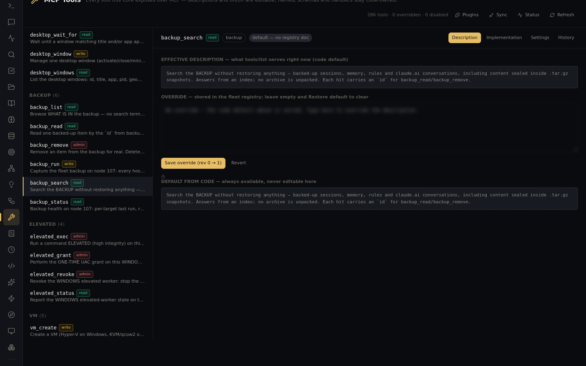

# Full claude.ai conversation search

Goal: find anything you ever discussed on claude.ai — full-text, across every conversation —
without scrolling the claude.ai sidebar.

Two layers work together: **live reads** through the claude.ai proxy, and a **searchable capture**
of the whole account.

## Live reads (always current)

From any connected Claude session:

```
list_claudeai_conversations            → newest conversations, names + uuids
read_conversation(uuid)                → full message history of one conversation
conversation_tokens(uuid)              → how big it really is (context measurement)
conversation_fork(uuid)                → branch it into a new conversation
```

The same data is on the REST surface: `GET /claude-ai/conversations`, `…/conversations/named`,
`…/conversations/:uuid/messages`, `…/tokens`, `…/fork`.

## Full-text search (the whole account)

The backup system captures **every claude.ai conversation as JSON** (plus the account memory) into
the fleet's backup store, and `backup_search` answers from an index — no archive is unpacked:

```
backup_run(target="claudeai")               # capture/refresh the account into the store
backup_search("that pricing discussion")    # full-text across everything captured
backup_read(id)                             # pull one hit — the full conversation JSON
```

A search hit looks like (illustrative output):

```
backup_search("chokidar pin")
  1. conversation · claudeai · "Debugging the watcher crash" · 2026-05-12 · id=cv-9f2…
  2. conversation · claudeai · "Release checklist"           · 2026-08-30 · id=cv-1a7…
Each hit carries an `id` for backup_read / backup_remove.
```

`backup_search` covers claude.ai conversations alongside backed-up sessions, memory and rules —
the tool's own description spells it out:



Notes:
- Backup tools run on the fleet's **collector node** (the one holding the backup store root) —
  calls from elsewhere return a pointer telling you which `node:` to pass.
- Run `backup_run` with `dryRun: true` first on a fresh setup to see what would be captured.
- Re-running the capture refreshes changed conversations; search stays index-fast.
