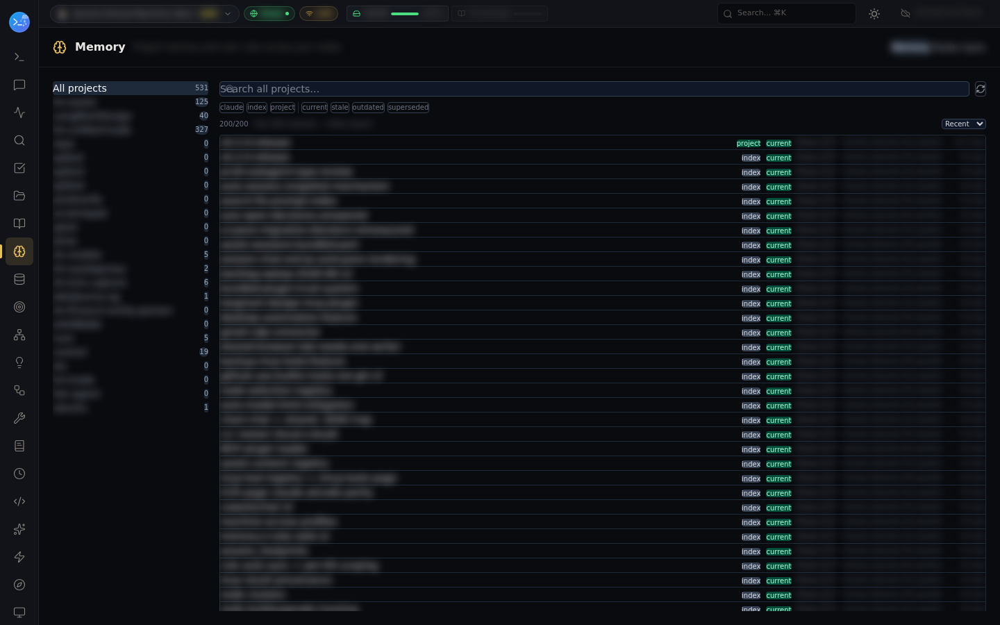

# Cross-node, cross-project memory

Claude Code keeps curated memory per project — markdown files under
`~/.claude/projects/<project>/memory/` with a `MEMORY.md` index that loads into every session.
It's the operator's own captured facts, feedback, and project notes. Left alone, that memory is
trapped twice: per **project**, and per **machine**.

lm-assist makes the same files one surface across both boundaries — searchable, comparable, and
importable from any Claude session, without changing how Claude Code writes them.

## Ask anything, anywhere

```
you:    do I have notes on the chokidar pin?
claude: → search_memory("chokidar pin")
        2 hits — [project A] deployment-build-gotchas: "…pin must stay ^3.6.0…"
                 [project B] release-checklist: "…verify the pin before packing…"
```

`search_memory` sweeps **every project's memory by default** and tags each hit with its project.
Real full-text search (bm25, CJK-aware) — not substring noise.

## One project, every machine

```
memory_projects                          → project slugs + which hosts hold mirrors
memory_cross_host(project_id, query)     → hits across the live dir AND every host mirror,
                                           each flagged presentLocally / stale
memory_import_candidates(project_id)     → files another machine has that this one lacks
                                           (or has newer) — suggested, never auto-imported
memory_file(project_id, name)            → read one memory in full
memory_record / memory_write             → save a new fact from any session
memory_map(stats=true)                   → the whole estate at record level — here: 400+
                                           records across a dozen projects and 3 nodes
```

Under the hood the memory dirs are mirrored between hosts by the convergent memory sync, so
"what does any of my machines remember about X" is one call, and staleness is measured rather
than guessed.

## Rules travel the same way

The `rule_*` twins (`rule_map`, `rule_cross_host`, `rule_record`, `rule_sync_status`,
`rule_import_candidates`) do the same for `~/.claude/rules/` — with **fleet auto-convergence**
for user rules and per-OS scoping, so a Windows-only rule never haunts a Linux node.

## The Web UI view

The Memory page shows the whole estate — projects down the left with live counts, records with
type and freshness chips (`current` / `stale` / `outdated` / `superseded`), search across all
projects, and a Rules tab beside it:



Notes:
- lm-assist reads and mirrors the files Claude Code already owns — there is no second memory
  store to keep consistent.
- Import is deliberately a suggestion (`memory_import_candidates` is read-only); the operator
  or a session chooses what crosses machines.
- The knowledge store (auto-extracted from sessions, searched by `search`) and claude.ai
  conversations (see [claudeai-conversation-search](../claudeai-conversation-search/)) are
  separate layers — this one is the memory *you* curated.
