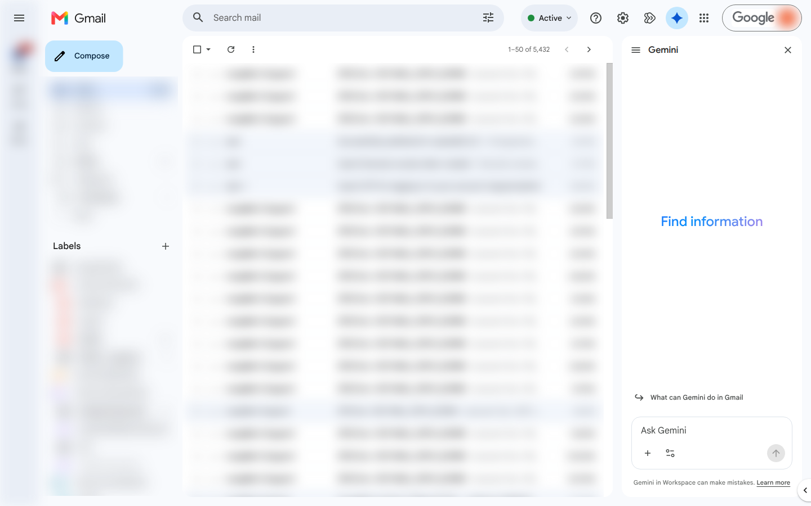
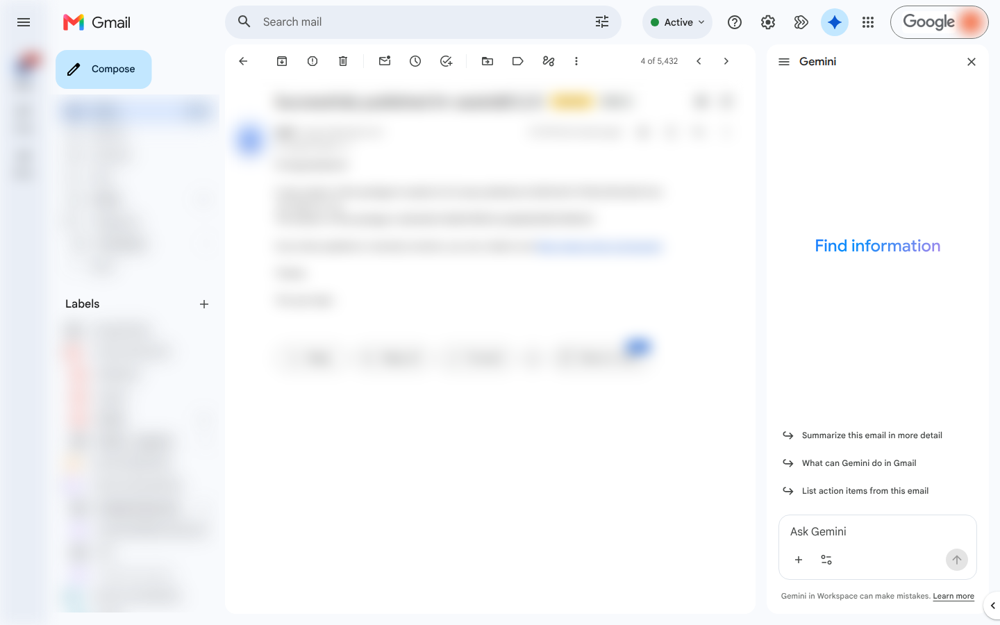

# Gmail connector

Goal: read, search, and act on a real Gmail account from any Claude session — driving the
operator's **own logged-in browser** over the DevTools Protocol. No Google API project, no OAuth
app: the node owns a dedicated Chrome profile that stays signed in.

## One-time setup

```
gmail_status                 # is this node's profile signed in?
gmail_login                  # if not: launches a headed browser once — sign in, done
```

The profile lives in the node's own directory on debug port **9224** (WhatsApp uses 9222 and
LinkedIn 9223, so all three connectors run side by side). After the one-time headed login the
connector operates headless against the same profile — the session survives restarts.

## Everyday use

```
gmail_list_threads                     → live inbox, keyed by Gmail's REAL thread ids
gmail_read_thread(id)                  → full thread content
gmail_search("is:unread from:stripe")  → any Gmail query — search is a URL change, not UI typing
gmail_labels / gmail_apply_label       → label management
gmail_send / gmail_reply / gmail_draft → writes (from the account's default send-as identity)
```

Illustrative session:

```
> gmail_search("subject:invoice newer_than:7d")
  3 threads:
  t-18c2…  "Invoice #4021 — March"        · 2 msgs · unread
  t-18c1…  "Your invoice is ready"        · 1 msg
  t-18bf…  "Re: invoice adjustment"       · 5 msgs
> gmail_read_thread("t-18c2…")
  …full messages, live from the mailbox…
```

Every read is **live** — Gmail owns read-state server-side and can backfill history, so there is
no local message store to drift. The DOM exposes real server ids (`data-legacy-thread-id`), so
threads are keyed properly rather than by display name.

The connector's actual browser (content blurred):





Notes:
- Tools are advertised fleet-wide but only a node with a signed-in profile can serve them — ask
  `gmail_status` per node. Restarting that node's Core kills the browser it launched; the next
  call relaunches it from the persisted profile.
- The account can carry multiple send-as identities; "who is this mail from" is read from the
  compose dialog, never inferred from the signed-in address.
