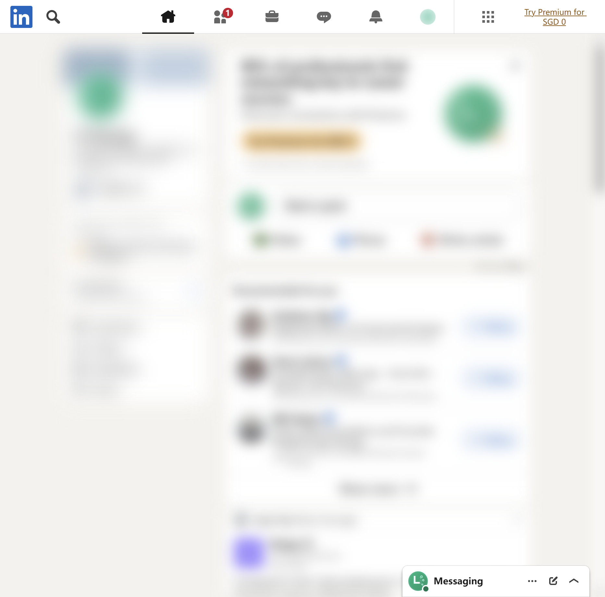

# LinkedIn connector

Goal: read your LinkedIn feed, notifications and messages — and post, comment, connect, or
message — from any Claude session. There is **no personal LinkedIn API**, so every read and write
drives a real logged-in browser (CDP, debug port **9223**, its own persistent profile).

## One-time setup

> **You:** connect LinkedIn on this node
>
> **Claude:** *(lm-assist → linkedin_login)* A browser window just opened at linkedin.com — log in once with your email, password, and 2FA; the profile keeps the session.
>
> **You:** done, I'm logged in
>
> **Claude:** *(lm-assist → linkedin_status)* Confirmed — the driver browser reports `loggedIn: true`. Ready to read and post as your account.

Tools involved: linkedin_status, linkedin_login

## Everyday use

> **You:** anything new on LinkedIn?
>
> **Claude:** *(lm-assist → linkedin_read_notifications)* Five new — two reactions on your latest post, one comment ("Congrats on the release!"), and two connection invitations.
>
> **You:** who's been messaging me?
>
> **Claude:** *(lm-assist → linkedin_list_conversations)* Three recent conversations: "J. Recruiter" (1 unread, "Would you be open to…"), "Old Teammate" (caught up), and a meetup group chat. Want me to open one?

Writes publish to the operator's real account and network, so Claude confirms the content first:

> **You:** post that we shipped v0.2.0, the control-plane release
>
> **Claude:** Draft post: "We just shipped v0.2.0 — the control-plane release: session observability, fleet connectivity, and a full MCP surface, self-hosted." This publishes publicly to your network — post it?
>
> **You:** post it
>
> **Claude:** *(lm-assist → linkedin_post)* Posted as the signed-in account — it's live on your feed.

> **You:** find platform engineers I could reach out to
>
> **Claude:** *(lm-assist → linkedin_search_people)* Top matches for "platform engineer": three profiles, each with name, handle, and profile URL. I can send a connection request with a short note — that's a real invitation from your account, so tell me who and what it should say.

Tools involved: linkedin_read_feed, linkedin_read_notifications, linkedin_list_conversations, linkedin_read_messages, linkedin_search, linkedin_search_people, linkedin_post, linkedin_comment, linkedin_publish_article, linkedin_connect, linkedin_follow, linkedin_send_message, linkedin_message_profile

The connector's actual feed (content blurred):

Notes:
- LinkedIn **virtualizes** its lists: a read captures only what is currently rendered, and results
  accumulate across calls — there is no "fetch history".
- Writes act on the operator's real account and profile; treat posts/messages like any outward
  publication.
- Tools are node-scoped: the node with the signed-in profile serves them (`linkedin_status` per
  node tells you which).
