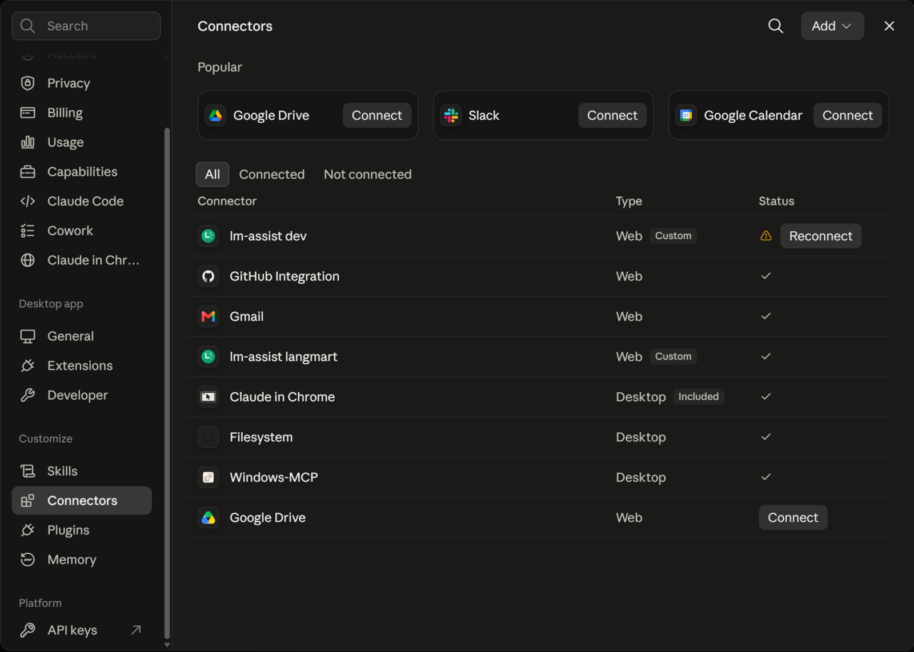
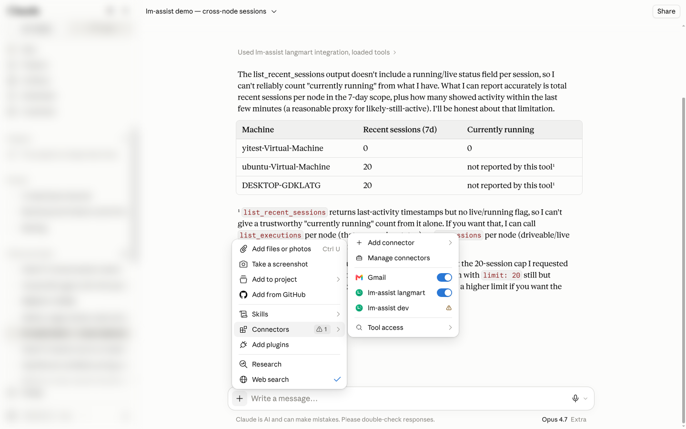
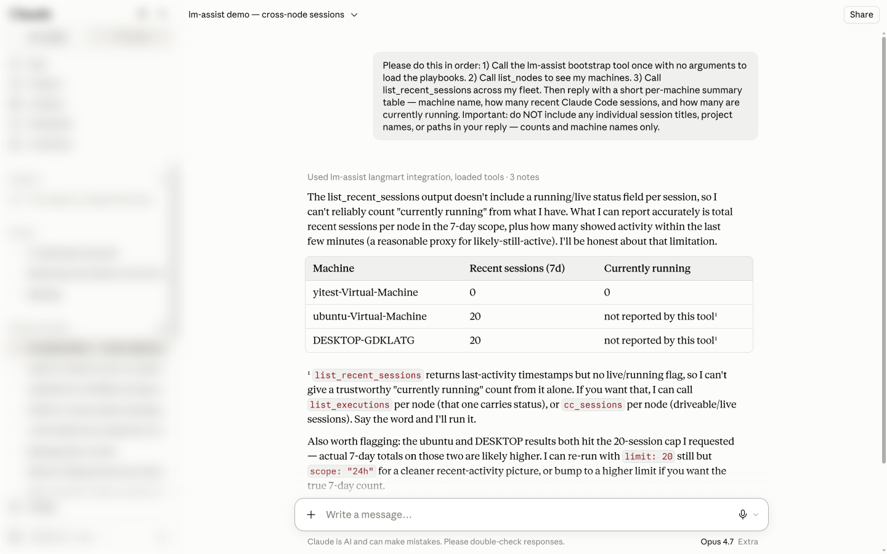
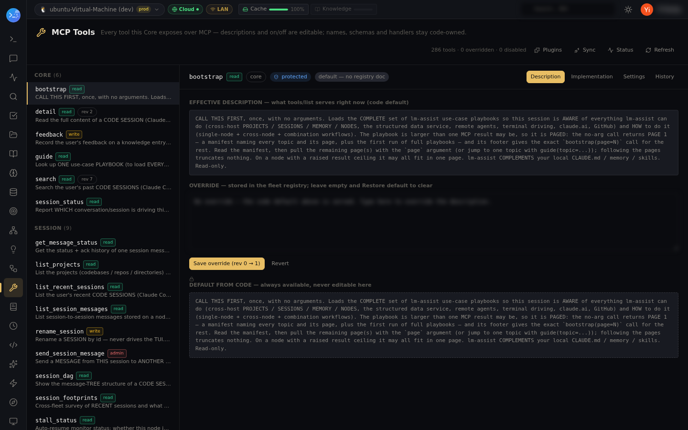

# The MCP connector — installed for you, relayed by the hub

Goal: every capability of your fleet — sessions, search, memory, terminal driving, missions,
connectors, VMs, containers — available as tools inside **claude.ai conversations**, **Cowork
sessions**, the **Claude desktop app**, and **Claude Code**. This is the main door; the
architecture behind it is in [`docs/mcp-connector.md`](../../docs/mcp-connector.md).

## You don't install it — lm-assist does

Connect a node to the hub once and the connector is provisioned for you. In the Claude desktop
app (Settings → Connectors) it appears as **lm-assist langmart** — *Web · Custom* — with a green
check the moment it's connected:

The same connector is what you toggle inside any conversation, from the composer's
**+ → Connectors** submenu (with *Tool access* for per-tool approval):

How it got there, in plain terms:

> **You:** *(on a fresh machine)* `lm-assist login <keypack>` — the one-time keypack minted on an enrolled node
>
> **lm-assist:** `OK — authenticated.` The node now holds one outbound WebSocket to the hub; the
> connector for your user is provisioned on the hub, and the hub MCP server is registered for
> Claude Code in `~/.claude.json` (owner-only) — worker tools load in NEW sessions.

Enrollment covers both doors at once: claude.ai / the Claude app see the connector on the
hub's public MCP endpoint, and Claude Code on that machine gets the same server locally
(`--no-mcp` opts out). Nothing to paste, no URL to add by hand.

## Why the hub relays

claude.ai, Cowork, and the Claude app run in Anthropic's cloud — an MCP connector has to be an
HTTPS endpoint they can reach. Your machines are behind NAT with no inbound ports. So the hub
serves the public endpoint (`https://mcp.<your-hub-domain>/mcp`), authenticates the call as
your connector, and **relays** it over the node's own outbound WebSocket to the node that
should answer; the result comes back the same way with a provenance footer naming the hub,
node, and cluster. Claude Code on the same machine skips the relay entirely — it spawns the
MCP server over stdio against the local Core. Cross-node reach *is* the relay: a claude.ai chat
reading a session on your Windows box and driving a terminal on your Linux server.

## First words: bootstrap

Every connected conversation starts by asking for the playbooks once — you can say it however
you like:

> **You:** load lm-assist, then list my recent Claude Code sessions across all my machines — counts per machine only
>
> **Claude:** *(lm-assist → bootstrap, list_nodes, list_recent_sessions)* Loaded the playbooks.
> You have three machines online; here's the 7-day session count per machine — and one honest
> caveat: this listing carries no live/running flag, so I can check `list_executions` per node
> if you want "currently running" too.

That exchange is real — captured from a claude.ai conversation, sidebar masked; note the
"Used lm-assist langmart integration" line and the model's own caveat:

From then on, `guide` answers single "how do I …" questions:

> **You:** how do I hand someone a live dashboard from here?
>
> **Claude:** *(lm-assist → guide)* Ask me for any dashboard by name and I'll return its gateway
> URL from `ui_list` — the mission graph, backlog, sessions, and 19 others are registered.

Tools involved: bootstrap, guide, list_nodes, list_recent_sessions

## Managing the surface

The **MCP Tools** page shows every tool the Core exposes — scope badges, per-tool description
overrides and enable/disable, synced fleet-wide through the registry:

And when a plugin adds tools, you don't touch claude.ai's settings — lm-assist keeps the
connector current (cache refresh, tool access, auto-approval) as long as the node holds a
claude.ai session ([claudeai-browser-auth](../claudeai-browser-auth/)):

> **You:** I enabled the new plugin on the linux box — do its tools show up in claude.ai yet?
>
> **Claude:** *(lm-assist → refresh_connector_tools)* Refreshed the connector: claude.ai's cached
> tool list was cleared and refetched, the 6 new tools are enabled for your account and
> auto-approved. They'll be offered in your next message.

Tools involved: refresh_connector_tools, set_connector_tool_access, set_connector_auto_approve, list_claudeai_connectors
