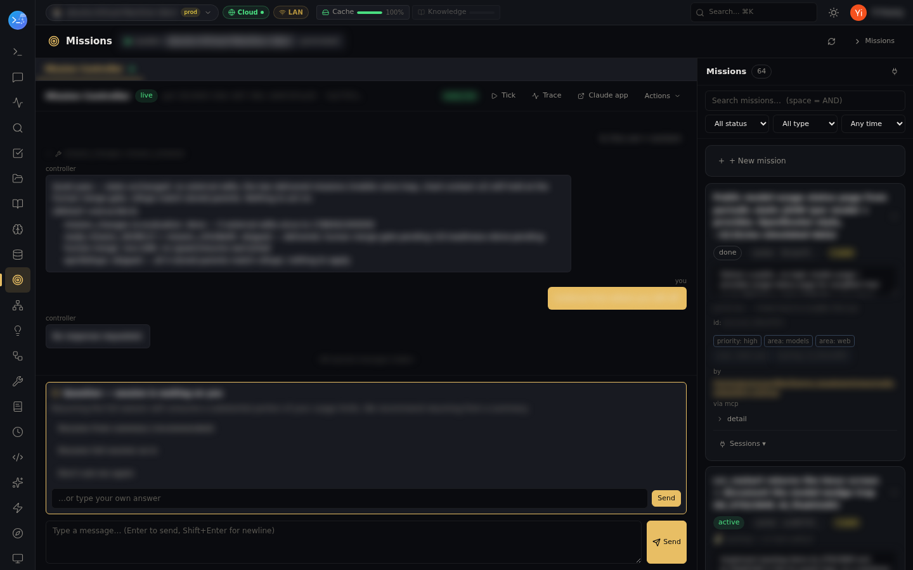

# Mission control — Claude Code sessions that drive themselves

Missions turn "keep working on this until it's done" into infrastructure. A mission is a goal
with tags, relationships, and history; a **fleet-elected controller** session spawns worker
Claude Code sessions for it, watches them, answers their questions, and re-engages when they
stop. Workflows describe the repeatable shapes.

## Driving work

All of it is plain conversation — from claude.ai, Cowork, or any Claude Code session:

> **You:** create a mission to get the flaky e2e suite green, and put it on whichever machine is free
>
> **Claude:** *(lm-assist → mission_create, mission_place, mission_spawn)* Created **msn_7c31** "Stabilize the e2e suite". Placement came back go on **linux-box** — no dependency gate, no resource conflict — so I spawned the native executor there: a Claude Code session named after the mission, worktree ensured, binding persisted. The controller picks it up on its next tick.

> **You:** how's the worker doing — has it asked for anything?
>
> **Claude:** *(lm-assist → mission_sessions, mission_session_read)* One active worker on **msn_7c31**. Its last message says it traced the flake to a shared test fixture, and it's now blocked on a question: "Delete the retry wrapper, or keep it behind a flag?" with two suggested answers.

> **You:** keep it behind a flag
>
> **Claude:** *(lm-assist → mission_session_answer)* Answered the pending question with "Keep it behind a flag." The worker unblocked and is continuing; the controller re-engages if it stops.

Tools involved: `mission_create`, `mission_place`, `mission_spawn`, `mission_sessions`, `mission_session_read`, `mission_session_drive`, `mission_session_answer`, `mission_workflow_set`, `mission_workflow_get`, `mission_workflow_list`, `mission_onboard`, `mission_graph`, `mission_history`

The controller is itself a Claude session — elected across the fleet, failing over if its node
goes down — so the "auto" in autopilot is a real agent reading executor feedback, not a cron
loop. The Missions page shows the controller conversation live, including the moments it needs
you (a question card with suggested answers):

## The resilience utilities underneath

Two independent monitor passes keep long-running sessions alive — they are deliberately
separate classes and never cross:

- **Server / network interruptions → auto-resume.** Sessions stalled on 529/5xx/server rate
  limits or transient connectivity loss are resumed with `continue`. Backoff widens
  (5,5,10,10,15… min), is capped (default 30 min), and by default **never gives up** — a long
  outage recovers the moment connectivity returns. It never touches usage limits or auth.
- **Model usage limit → model fallback.** When one model is exhausted ("You've reached your …
  limit"), `continue` can't help — so the monitor sends `/model <fallback>` (default Opus) and
  verifies the **live status line** actually moved off the limited model. The banner alone is
  never trusted (it's transcript history), and an explicit human "keep model" choice is never
  overruled. Your session keeps working through the limit window instead of idling.

Check both from anywhere: `stall_status` (MCP) or `GET /monitor/stalls`. Scheduler jobs cover
the rest of the utility belt — one-time (`run_at`), recurring, or trigger-only jobs with full
run capture and guard conditions.
