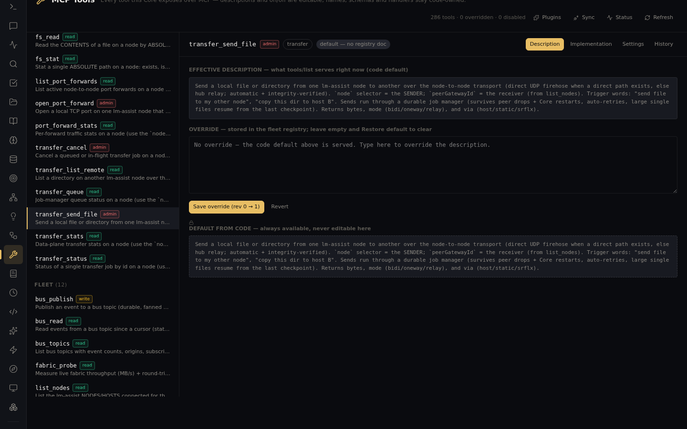

# Cross-node file transfer & Claude Code session backup

Two utilities that treat your fleet's data as one estate: move any file or directory between
machines with a durable, resumable job — and capture every host's Claude state into one
searchable backup store.

## Cross-node transfer

```
transfer_send_file(path, node, peerGatewayId)   → durable job: direct UDP firehose when a
                                                   direct path exists, hub relay otherwise;
                                                   integrity-verified end to end
transfer_queue / transfer_status(id)            → job-manager state, per-job progress
transfer_cancel(id)                             → stop one cleanly
transfer_stats / port_forward_stats             → data-plane throughput
transfer_list_remote(node, path)                → browse the other machine before pulling
```

Jobs **survive peer drops and Core restarts**, auto-retry, and large single files resume from
the last checkpoint — a multi-GB transfer interrupted mid-way continues rather than restarting.
Direct node-to-node port-forward transport bypasses the hub when possible (~4× faster). The
tool's own registry entry tells the story:



## Claude Code session backup

The backup system captures **every host's `~/.claude`** — sessions, memory, rules — plus your
claude.ai conversations into one store on the fleet's collector node, then makes it searchable
without unpacking anything:

```
backup_run(target, dryRun: true)   → see what a pass would capture (always dry-run first)
backup_status                      → per-target last run, store health
backup_list / backup_search("…")   → browse, or full-text search inside the snapshots
backup_read(id)                    → pull one item back out
```

Notes:
- Only the node holding the store root is the collector; calls from elsewhere return a pointer
  telling you which `node:` to pass — routing is one argument, not a diagnosis.
- Snapshots retain history per target, so "what did that session say last month" survives local
  cleanup — this is also what powers
  [full claude.ai conversation search](../claudeai-conversation-search/).
