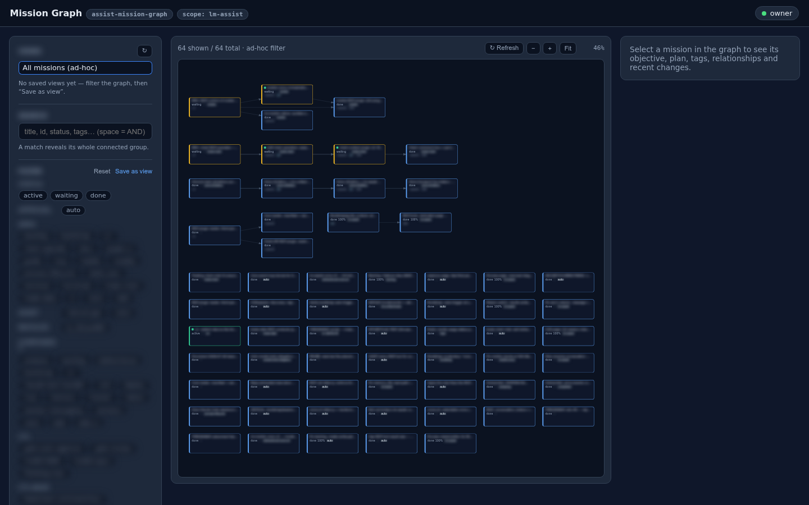

# UI panes — Claude hands you a live dashboard, mid-conversation

The most distinctive door in lm-assist: **pluggable UI pages**. Every dashboard is also a
self-contained page with its own URL on the platform gateway — so a Claude session
(claude.ai conversation, Cowork session, or Claude Code local/remote) can *show you UI*
instead of describing things in text.

```
you:    how are the missions connected? show me.
claude: → ui_list
        Here's your live mission graph:
        https://ui-<your-key>-assist-mission-graph.langmart.ai
```

Click it, sign in once (platform SSO), and you're looking at the real thing — interactive,
current, from anywhere:



## What ships as panes

22 first-party pages are registered out of the box — Sessions, Session Dashboard, Projects,
Tasks, Missions, Mission Graph, Mission Processes, Scheduler, Backlog, Search, Knowledge,
Memory & Rules, Content, Clusters, Data, MCP Tools, Skills, and the UI Pages manager itself,
plus account-level pages (Home, API Keys, Machines, WhatsApp). Each is independently
addressable: `https://ui-<your-key>-<page>.langmart.ai`.

## The tools a session uses

```
ui_list                 → your registered pages + whether each one's server is alive,
                          with the gateway URL to hand to the user
ui_pages                → local serving status on a node (ports, alive, respawnable)
ui_register             → publish a page served from a node onto the gateway
ui_enable(uiId, false)  → platform-wide off-switch (registration + grants + files remain)
ui_pages_control        → local server / boot behavior on the node
ui_screenshot           → upload a catalog screenshot for a page
```

Because registering is just a tool call, a session can go further than showing the built-in
pages: scaffold a small page on a node, register it, and hand you the URL — a purpose-built
dashboard that didn't exist when the conversation started.

## How it stays safe

- Every pane runs under **per-page API grants**: the gateway relay reaches the node's API as
  the owner, so each page is granted exactly the endpoints it renders from — nothing more.
  Grants are part of the pane's definition and are enforced on the hub path.
- Pages are **SSO-gated** on the platform; a node-local tier exists for LAN/dev access with
  short-lived, single-redemption entry tokens.
- `scope: assist-web` pages are gateway-hosted — they serve even when no node is up; the
  node-scoped pages serve from their owning machine and auto-respawn when its Core boots.
