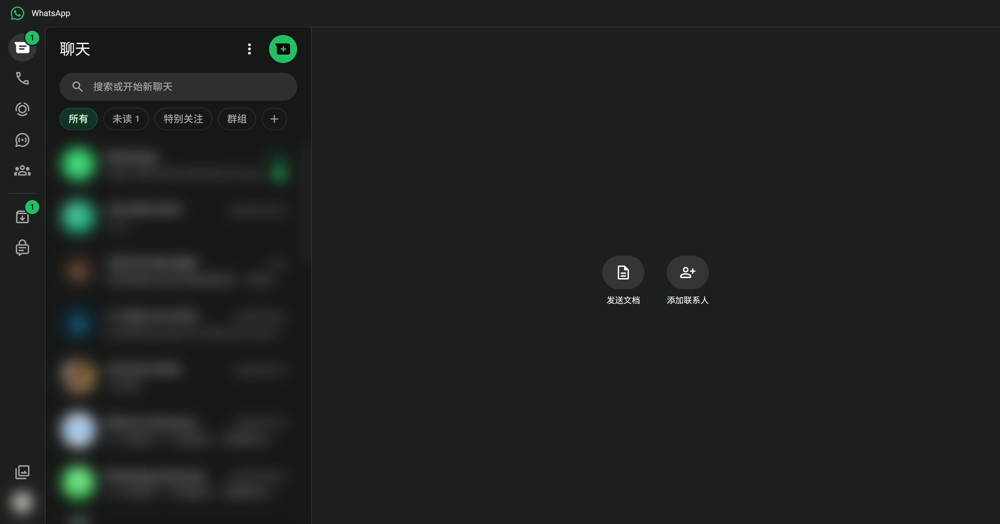

# WhatsApp connector

Goal: read and send WhatsApp messages from any Claude session. WhatsApp has no personal API — the
connector drives a real **WhatsApp Web** tab in the node's own browser (CDP, debug port **9222**)
and mirrors messages into a local store, because WhatsApp Web cannot backfill history the way
Gmail can.

## One-time setup

Link the node's browser to your phone once (QR scan in the connector's browser window). The
session persists in the dedicated profile.

## Everyday use

> **You:** is WhatsApp set up on this node?
>
> **Claude:** *(lm-assist → whatsapp_status)* Linked and ingesting — 340 messages across 12 chats mirrored so far, 3 unread.
>
> **You:** did anyone say the meeting moved?
>
> **Claude:** *(lm-assist → whatsapp_search)* Two hits in the mirrored store: "Ops group" on Aug 29 ("meeting moved to 3pm, same room") and "A. Vendor" on Aug 30 ("let me know if the meeting moved again"). Want the full Ops group chat?

Sends go out as the operator's real linked account, so Claude confirms first:

> **You:** yes — and tell the group I'll be there at 3
>
> **Claude:** *(lm-assist → whatsapp_read_messages)* Latest in "Ops group": the 3pm move is confirmed, and someone asked who's presenting. Ready to send "I'll be there at 3" — it goes out as your linked account. Send?
>
> **You:** send it
>
> **Claude:** *(lm-assist → whatsapp_send)* Sent to "Ops group".

Received attachments carry a media id, so they can be pulled onto the node:

> **You:** the vendor sent a voice note earlier — what does it say?
>
> **Claude:** *(lm-assist → whatsapp_get_media)* Fetched the voice note to the node. Short version: they confirm Thursday's delivery slot and ask you to reply with the gate code.

Tools involved: whatsapp_status, whatsapp_list_chats, whatsapp_read_messages, whatsapp_search, whatsapp_send, whatsapp_get_media

The connector's actual tab (content blurred):

Notes:
- WhatsApp Web allows **one active tab** — the connector owns it. Don't open web.whatsapp.com
  yourself on that profile, and treat the tab as having a single writer: a background mirror job
  plus interactive driving on the same tab means the wrong page for one of them.
- Because lists are mirrored as they are seen, the store grows with use; there is no "fetch all
  history" call.
- Sends act as the operator's real account — same care as any outward write.
