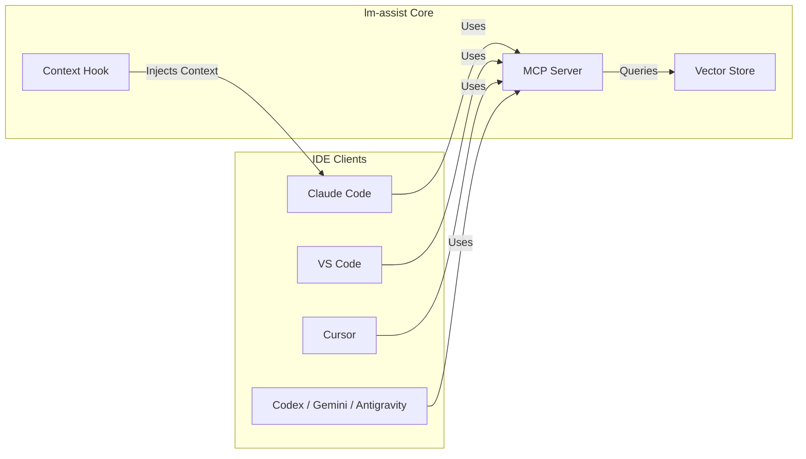
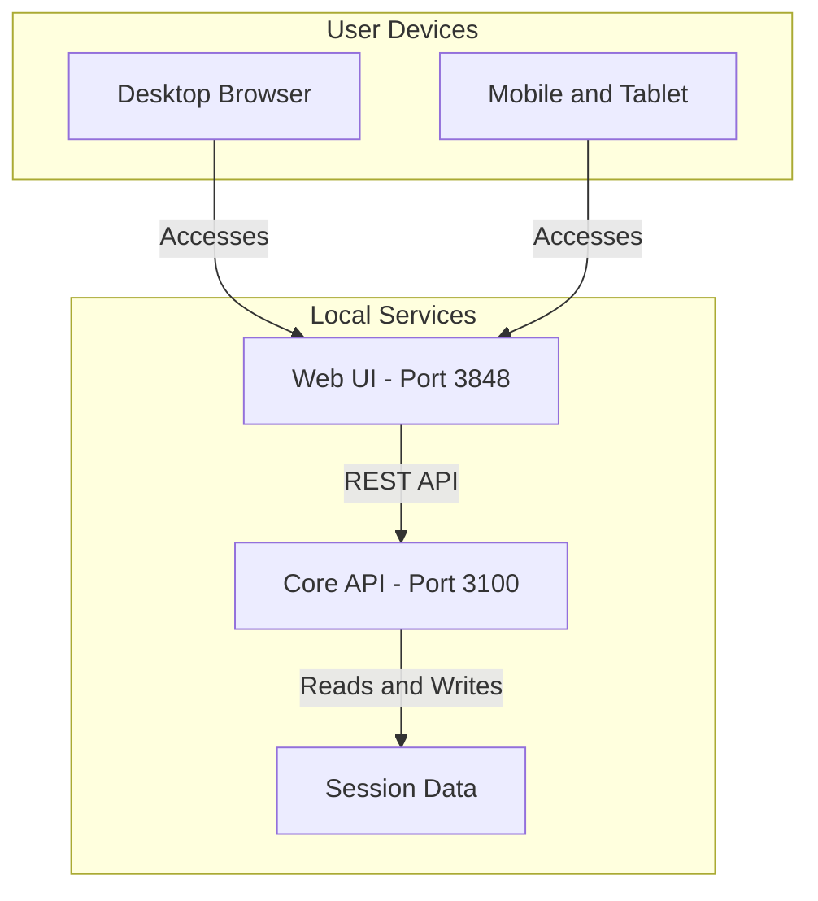

# TikTok Promotion Content & Architecture

## TikTok 1: Mobile Terminal Control
**Visual:** Screenshot of the Claude Code terminal running on a mobile phone.
**On-Screen Text / Caption:**
> "Control your desktop Claude Code terminal directly from your phone! 📱💻 No extra setup needed—just connect and code on the go. #ClaudeCode #CodingOnMobile #DeveloperTools"

## TikTok 2: Session Knowledge Retrieval
**Visual:** Two screenshots (1 showing the knowledge list, 1 showing the knowledge detail view).
**On-Screen Text / Caption:**
> "Stop losing your AI chats! 🛑 Turn your Claude Code sessions into a searchable knowledge base. 🧠✨ Here’s how to retrieve past insights instantly. #AI #Productivity #Claude"

## TikTok 3: MCP/Hook for Any IDE
**Visual:** Screenshot showing the MCP integration settings or context injection in an IDE.
**On-Screen Text / Caption:**
> "Bring your Claude knowledge to ANY IDE! 🚀 Use MCP hooks to sync your sessions with VS Code, Cursor, Codex, and more. Code smarter, not harder. 🛠️🔥 #IDE #Cursor #VSCode #10xDeveloper"

---

## Architecture Diagrams

Here is the architecture split into two distinct diagrams, strictly following the Mermaid rules.

### 1. MCP & IDE Integration Architecture

### 2. Web UI & Local Services Architecture

